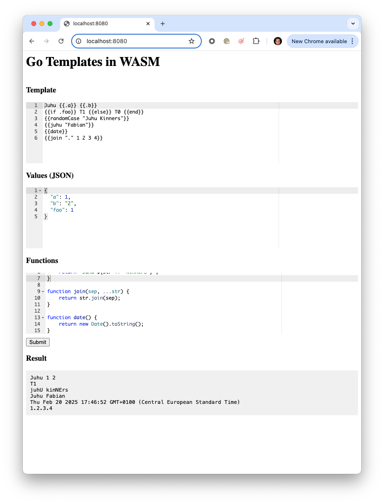

# Go Templates in WASM

Rendering Go [https://pkg.go.dev/text/template](text/template) templates in the browser using WASM.

## Features

- Render Go text/template templates in the browser
- Pass data from JavaScript to the Go template
- Pass functions from JavaScript to the Go template



test it out at [https://fjakobs.github.io/go-template-wasm/html/](https://fjakobs.github.io/go-template-wasm/html/)

## How it works

The Go code is compiled to WebAssembly using `GOARCH=wasm` and `GOOS=js` and then compressed using brotli compression. The `text/template` package which is used to render the template heavily relies on reflection, which prevents us from generating smaller binaries using `tinygo`. 

| File | Size | Description |
| --- | --- | --- |
| `main.wasm` | 4.1 MB | Compiled Go code |
| `main.wasm.br` | 832 KB | Compiled Go code compressed using brotli |
| `wasm_exec.js` | 16 KB | Go runtime for the browser |

## Compiling and Running locally

Compile the Go code to WASM:

```bash
make
```

Start a local web server:

```bash
make serve
```

Open [http://localhost:8080](http://localhost:8080) in your browser.